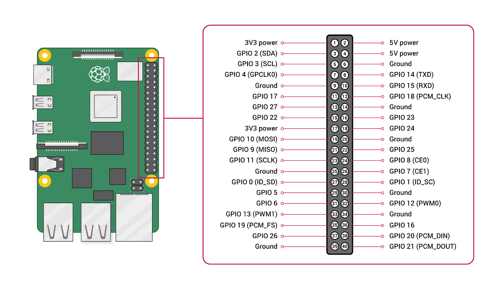

# API CTUCL Parada

## Descripción

Este proyecto corresponde a una API para el control del mecanismo de acceso a una parada de bus mediante un sistema de torniquete.

El software está diseñado para ejecutarse en una **Raspberry Pi** con:

- Sistema operativo **Raspberry Pi OS Lite (64 bits)**
- Versión **Bookworm**

---

# Copiar el proyecto a la Raspberry Pi

Desde el equipo de desarrollo, copie el proyecto utilizando el siguiente comando:

```bash
scp -r ./api-ctucl-parada admin@raspberry.local:/home/admin
```

---

# Instalación

## Paso 1. Actualizar el sistema

```bash
sudo apt update && sudo apt full-upgrade
```

---

## Paso 2. Instalar Python y las herramientas para entornos virtuales

```bash
sudo apt install python3-virtualenv python3-venv
```

---

## Paso 3. Crear el entorno virtual

El entorno virtual se almacenará en la carpeta personal del usuario `admin`, independiente del proyecto.

```bash
python3 -m venv /home/admin/env
```

---

## Paso 4. Activar el entorno virtual

> **Importante:** Active el entorno virtual antes de instalar cualquier dependencia. De lo contrario, los paquetes se instalarán en el Python global del sistema y no en el entorno virtual.

```bash
source /home/admin/env/bin/activate
```

---

## Paso 5. Instalar las dependencias

Con el entorno virtual ya activado, ubíquese en la carpeta del proyecto e instale las dependencias:

```bash
cd /home/admin/api-ctucl-parada

pip install gpiozero
pip install rpi-lgpio
pip install flask
pip install pyserial
pip install python-dotenv
pip install paho-mqtt
```

Si el proyecto incluye un archivo `requirements.txt`, puede instalar todas las dependencias con:

```bash
pip install -r requirements.txt
```

---

## Paso 6. Ejecutar la aplicación

```bash
cd /home/admin/api-ctucl-parada

python main.py
```

---

# Configuración del servicio con systemd

Para que la aplicación se inicie automáticamente al encender la Raspberry Pi, configure un servicio de **systemd**.

## Paso 1. Crear el archivo del servicio

```bash
sudo nano /etc/systemd/system/api_ctucl_parada.service
```

---

## Paso 2. Agregar la siguiente configuración

```ini
[Unit]
Description=Aplicación para controlar la parada
After=network.target

[Service]
User=admin
WorkingDirectory=/home/admin/api-ctucl-parada
ExecStart=/home/admin/env/bin/python /home/admin/api-ctucl-parada/main.py
Restart=always

[Install]
WantedBy=multi-user.target
```

---

## Paso 3. Recargar y habilitar el servicio

```bash
sudo systemctl daemon-reload

sudo systemctl enable api_ctucl_parada

sudo systemctl start api_ctucl_parada
```

---

# Comandos útiles para el servicio

### Reiniciar el servicio

```bash
sudo systemctl restart api_ctucl_parada
```

### Ver el estado del servicio

```bash
sudo systemctl status api_ctucl_parada
```

### Detener el servicio

```bash
sudo systemctl stop api_ctucl_parada
```

### Ver los registros en tiempo real

```bash
sudo journalctl -u api_ctucl_parada.service -f
```

---

# Hardware utilizado

## Diagrama de pines GPIO



> Puedes obtener el diagrama oficial actualizado en [pinout.xyz](https://pinout.xyz/) 
> y descargar una captura para colocarla en `docs/img/raspberry-pi-gpio-pinout.png`.
> Se recomienda anotar sobre la imagen los pines usados por este proyecto (ver tabla abajo).

## Pines GPIO (salidas)

| GPIO (BCM) | Variable en código        | Función                          |
|------------|----------------------------|-----------------------------------|
| GPIO 6     | `lock`                     | Cerradura del torniquete          |
| GPIO 5     | `electromagnet`            | Electroimán (puerta normal)       |
| GPIO 17    | `special_electromagnet`    | Electroimán (puerta especial)     |
| GPIO 27    | `arrow_light`               | Flecha LED indicadora             |
| GPIO 21    | `actuator_up`               | Extender actuador (puerta especial) |
| GPIO 20    | `actuator_down`             | Retraer actuador (puerta especial)  |

> **Nota:** todos los pines de salida inician en estado `.on()`, que corresponde 
> al estado "cerrado/inactivo" según el cableado del relé (lógica activa en bajo).

## Sensores (entradas)

| GPIO (BCM) | Variable en código | Descripción                          |
|------------|---------------------|----------------------------------------|
| GPIO 16    | `sensor_45`         | Sensor ubicado a 45°                   |
| GPIO 26    | `sensor`            | Sensor principal (posición normal)     |

> Ambos sensores usan `pull_up=True`, por lo que `read_sensor()` y `read_sensor_45()` 
> devuelven `True` cuando el valor del pin es `0` (activado, contacto a tierra).